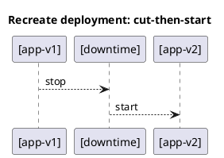

# Recreate Deployment Strategy



---

## ✅ Overview
The **Recreate** strategy stops the old version completely before starting the new one.  
**Downtime risk:** High (service is unavailable during the switch).  
**Rollback:** Easy (just redeploy the old image).

---

## Step 1: Run the Old Version
```sh
docker run -d --name app-v1 -p 8080:80 \
-v "C:\U1\podman\ngnix\index.html:/usr/share/nginx/html/index.html:Z" \
art.lpb.baltic.seb.net/dev-docker/nginx:latest
```

Verify
```sh
curl http://localhost:8080
````
```sh
docker logs app-v1
```

---

## Step 2: Stop and Remove Old Version
```sh
docker stop app-v1 && docker rm app-v1
```

---

## Step 3: Start the New Version
```sh
docker run -d --name app-v2 -p 8080:80 \
-v "C:\U1\podman\ngnix\index2.html:/usr/share/nginx/html/index.html:Z" \
art.lpb.baltic.seb.net/dev-docker/nginx:latest
```

Verify:
```sh
curl http://localhost:8080
docker logs app-v2
```

---

### ✅ Result
During the switch, the service is **completely down** (downtime risk = **high**).

---

## Optional Enhancements
- Check container health:
```sh
docker healthcheck run app-v2
```

- Cleanup:
```sh
docker stop app-v2 && docker rm app-v2
```

---

## Useful Commands
```sh
docker --help
````
```sh
docker images
```
