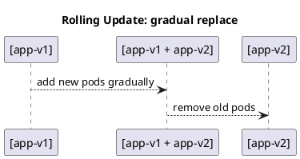

# Rolling Update Deployment Strategy



---

## ✅ Overview
The **Rolling Update** strategy replaces old instances gradually with new ones, ensuring **zero or minimal downtime**.  
**Downtime risk:** Low (configurable).  
**Rollback:** Easy (roll back to previous revision).

---

## Step 1: Start Two Old Version Instances

docker run -d --name app-v1-1 -p 8081:80 \
-v "C:\U1\podman\ngnix\index.html:/usr/share/nginx/html/index.html:Z" \
art.lpb.baltic.seb.net/dev-docker/nginx:latest

docker run -d --name app-v1-2 -p 8082:80 \
-v "C:\U1\podman\ngnix\index.html:/usr/share/nginx/html/index.html:Z" \
art.lpb.baltic.seb.net/dev-docker/nginx:latest

---

## Step 2: Configure Nginx as a Load Balancer
Create `nginx.conf`:
```nginx
events {}
http {
    upstream backend {
        server host.containers.internal:8081;
        server host.containers.internal:8082;
    }
    server {
        listen 8080;
        location / {
            proxy_pass http://backend;
        }
    }
}
```

Run Nginx as a reverse proxy:
```sh
docker run -d --name lb -p 8080:8080 \
  -v "C:\U1\podman\ngnix\nginx.conf:/etc/nginx/nginx.conf:Z" \
  nginx:latest
```

Test:
```sh
curl http://localhost:8080
```

---

## Step 3: Replace One Old Instance with New Version

docker stop app-v1-1 && docker rm app-v1-1
docker run -d --name app-v2-1 -p 8081:80 \
-v "C:\U1\podman\ngnix\index2.html:/usr/share/nginx/html/index.html:Z" \
art.lpb.baltic.seb.net/dev-docker/nginx:latest
```

---

## Step 4: Replace Remaining Old Instance
```sh
docker stop app-v1-2 && docker rm app-v1-2
docker run -d --name app-v2-2 -p 8082:80 \
  -v "C:\U1\podman\ngnix\index2.html:/usr/share/nginx/html/index.html:Z" \
  art.lpb.baltic.seb.net/dev-docker/nginx:latest
```

---

### ✅ Result
Traffic is served continuously by at least one instance during the update.  
**Downtime risk:** Low (depends on load balancer health checks).

---

## Optional Enhancements
- Add **health checks** in Nginx or docker.
- Automate with a **script** for gradual rollout.
- Use **weighted load balancing** for canary-like behavior.

---

## Useful Commands
```sh
docker ps
docker logs lb
```
