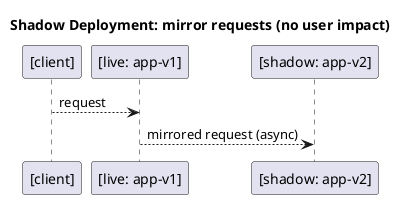

# Shadow Deployment Strategy



---

## ✅ Overview
**Shadow deployment** sends a **copy of each incoming request** to a *shadow* version of your service. The client only receives the **live** service’s response—**mirror responses are ignored**—so there’s no user-visible change while you validate performance and correctness on the new version. [1](https://nginx.org/en/docs/http/ngx_http_mirror_module.html)

**Typical goals:** exercise v2 under production-like load; catch regressions; compare latencies; validate new ML models—**without serving v2 responses** to users. (Nginx mirrors via background subrequests and discards the shadow response.) [1](https://nginx.org/en/docs/http/ngx_http_mirror_module.html)

---

## Step 1: Start the Live and Shadow Apps
Start **live** (v1) and **shadow** (v2) Nginx containers that serve different HTML pages so you can tell them apart:

```sh
docker run -d --name app-v1 -p 8081:80 ^
-v "C:\U1\podman\ngnix\index.html:/usr/share/nginx/html/index.html:Z" ^
art.lpb.baltic.seb.net/dev-docker/nginx:latest
````
```sh
docker run -d --name app-v2 -p 8082:80 ^
-v "C:\U1\podman\ngnix\index2.html:/usr/share/nginx/html/index.html:Z" ^
art.lpb.baltic.seb.net/dev-docker/nginx:latest
````
> We’ll reach these from the proxy using `host.containers.internal` (docker’s host alias), which lets a container connect to services published on the host’s ports. [2](https://stackoverflow.com/questions/58678983/accessing-host-from-inside-container)

---

## Step 2: Configure Nginx to Mirror Requests
Create `nginx-shadow.conf`:


events {}
http {
# Upstreams: live traffic goes to v1; mirrored traffic to v2
upstream live {
server host.containers.internal:8081;
}
upstream shadow {
server host.containers.internal:8082;
}

    server {
        listen 8080;

        # Client requests land here
        location / {
            # Mirror each request (as a background subrequest)
            mirror /shadow_mirror;
            # Do NOT read/forward the request body to the mirror (lighter touch)
            mirror_request_body off;   # see docs
            proxy_pass http://live;
        }

        # Internal location that actually sends the mirrored request
        location = /shadow_mirror {
            internal;

            # Forward to the shadow upstream, preserving the URI
            proxy_pass http://shadow$request_uri;

            # Mark mirrored traffic and scrub sensitive headers before sending
            proxy_set_header X-Shadow "1";
            proxy_set_header Cookie "";
            proxy_set_header Authorization "";
            proxy_pass_request_body off;
            proxy_set_header Content-Length "";
        }
    }
}

Key points:
- **`mirror`** creates **background mirror subrequests**; responses are **ignored**. [1](https://nginx.org/en/docs/http/ngx_http_mirror_module.html)
- **`mirror_request_body off`** avoids reading/forwarding request bodies to the mirror—useful to reduce load or avoid copying large payloads. [1](https://nginx.org/en/docs/http/ngx_http_mirror_module.html)
- **Header scrubbing** (`Cookie`, `Authorization`) helps limit PII/secret leakage to the shadow backend. (You can further tailor headers with `proxy_set_header`.) [3](https://nginxtutorials.com/nginx-proxy_set_header-directive/)

Run the reverse proxy:

```sh
docker run -d --name lb -p 8080:8080 ^
  -v "C:\U1\podman\ngnix\nginx-shadow.conf:/etc/nginx/nginx.conf:Z" ^
  nginx:latest
```

---

## Step 3: Test
Hit the proxy (clients talk only to **live**):

```sh
curl http://localhost:8080
```

Verify **live** handled the request:

```sh
docker logs app-v1 --tail 5
```

Verify **shadow** also received the mirrored request (but its response was not returned to the client):

```sh
docker logs app-v2 --tail 5
````

> In Nginx mirroring, the **client never sees** the shadow response; it’s discarded. [1](https://nginx.org/en/docs/http/ngx_http_mirror_module.html)

---

## ✅ Result
- Users see **only v1** responses, while **v2** receives a **copy** of production requests.
- **Zero user impact** if v2 is slow/broken; mirrored responses are discarded by Nginx. [1](https://nginx.org/en/docs/http/ngx_http_mirror_module.html)

---

## Optional Enhancements
- **Sample only a subset** of traffic (e.g., 10%) by enabling mirroring in specific locations or paths, or by routing only certain endpoints to the mirror. (Nginx allows multiple `location` blocks; apply `mirror` only where desired.) [1](https://nginx.org/en/docs/http/ngx_http_mirror_module.html)
- **Add more scrubbing**: strip or rewrite additional headers (e.g., `X-API-Key`) before sending to shadow. [3](https://nginxtutorials.com/nginx-proxy_set_header-directive/)
- **Record-only mirror**: keep `mirror_request_body off` for heavy uploads to limit cost; or enable it if you must test request bodies end‑to‑end. [1](https://nginx.org/en/docs/http/ngx_http_mirror_module.html)

---

## Troubleshooting
- **Can’t reach `host.containers.internal`?** Your environment may differ (especially on some Windows setups). Use published host ports as in this guide, or consider `--network=host` for the proxy container as a workaround. [2](https://stackoverflow.com/questions/58678983/accessing-host-from-inside-container)[4](https://stackoverflow.com/questions/78639124/docker-container-cant-access-a-service-on-host-via-host-gateway)
- **No logs on `app-v2`?** Ensure `mirror` points to the internal location and that `proxy_pass` there targets `shadow`. The mirror response never appears in the client—check the **shadow container logs** instead. [1](https://nginx.org/en/docs/http/ngx_http_mirror_module.html)

---

## Useful Commands
```sh
docker ps
````
```sh
docker logs lb
````
```sh
docker logs app-v1
````
```sh
docker logs app-v2
```

---

## References
- Nginx **`ngx_http_mirror_module`**: how mirroring works, `mirror_request_body`, and example configs. [1](https://nginx.org/en/docs/http/ngx_http_mirror_module.html)
- Community example/discussion of Nginx mirroring. [5](https://serverfault.com/questions/513859/mirroring-traffic-with-nginx)