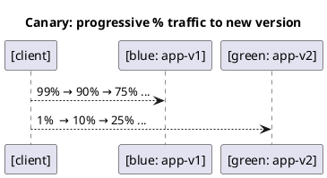

# Canary Deployment Strategy



---

## ✅ Overview
**Canary** gradually shifts a small, controlled percentage of traffic to a new version (v2) while most users continue to hit the stable version (v1). If metrics and logs look good, you increase the weight until 100%. If not, drop the weight back to 0% (instant rollback). This pattern is commonly implemented with NGINX using the `split_clients` module to create deterministic cohorts and route by percentage. [1](https://nginx.org/en/docs/http/ngx_http_split_clients_module.html)[2](https://www.compilenrun.com/docs/middleware/nginx/nginx-high-availability/nginx-canary-deployment/)

> `split_clients` hashes an input string (e.g., client IP) with **MurmurHash2** to assign each requester to a bucket, enabling **sticky cohorts** (the same user keeps the same variant). For canaries, you map a small percentage to “green” and the rest to “blue.” [1](https://nginx.org/en/docs/http/ngx_http_split_clients_module.html)

---

## Step 1: Run Stable (Blue) and Canary (Green) Apps

```sh
docker run -d --name app-v1 -p 8081:80 art.lpb.baltic.seb.net/dev-docker/nginx:latest
````
```sh
docker run -d --name app-v2 -p 8082:80 art.lpb.baltic.seb.net/dev-docker/nginx:latest
````
> We’ll have the reverse proxy talk to these via `host.containers.internal` (docker’s host alias exposed inside containers). If this alias doesn’t work in your specific Windows setup, see the troubleshooting notes below. [3](https://stackoverflow.com/questions/58678983/accessing-host-from-inside-container)[4](https://github.com/containers/docker/issues/14933)

---

## Step 2: Configure NGINX with Weighted Canary

Create `nginx-canary.conf`:

```nginx
events {}
http {
    # Upstreams for stable (blue) and canary (green)
    upstream blue  { server host.containers.internal:8081; }
    upstream green { server host.containers.internal:8082; }

    # Deterministic cohorting by client IP.
    # Start with 1% to canary (green), 99% to stable (blue).
    split_clients "${remote_addr}" $canary {
        1%     green;
        *      blue;
    }

    server {
        listen 8080;

        location / {
            # Route to the selected upstream by name (blue/green)
            # Using an upstream *name* with proxy_pass + variable is supported;
            # this pattern is widely used for A/B and canaries.
            proxy_pass http://$canary;
        }
    }
}
````
**Why this works**
- `split_clients` assigns each requester to **green** or **blue** by percentage using a consistent hash. [1](https://nginx.org/en/docs/http/ngx_http_split_clients_module.html)
- Using a variable with `proxy_pass` works when it resolves to an **upstream name** (as shown in NGINX/F5 examples); no DNS resolver is needed because you’re not proxying to a dynamic hostname. [5](https://my.f5.com/manage/s/article/K000138359)

Run the reverse proxy:

```sh
docker run -d --name lb -p 8080:8080 \
  -v "C:\U1\podman\ngnix\nginx-canary.conf:/etc/nginx/nginx.conf:Z" \
  nginx:latest
```

Test:

```sh
curl http://localhost:8080
```

---

## Step 3: Ramp Plan (Weights → Reload)

Increase the canary weight by editing the `split_clients` block and **reloading** NGINX:

- **1% → 10%**
  ```nginx
  split_clients "${remote_addr}" $canary {
      10%    green;
      *      blue;
  }
  ```
- **10% → 25%**, then **→ 50%**, and finally **→ 100%** (cutover) the same way.

Reload (no downtime):

```sh
docker exec lb nginx -s reload
```

> Tip: Because `split_clients` is **sticky per client** (e.g., by IP), testing with one machine might always hit the same color. Use multiple clients or change the split seed (e.g., include a cookie/header) to see both paths. [1](https://nginx.org/en/docs/http/ngx_http_split_clients_module.html)[6](https://stackoverflow.com/questions/77079269/nginx-split-clients-configuration-does-not-split-traffic-to-multiple-upstreams)

---

## Optional: Force Canary for Testers (Header Override)

If you want selected users (e.g., QA) to always hit **green**, add a simple **header override**:


http {
upstream blue  { server host.containers.internal:8081; }
upstream green { server host.containers.internal:8082; }

    split_clients "${remote_addr}" $canary {
        10%    green;  # normal canary %
        *      blue;
    }

    # If X-Canary: on/true/1 is present, force green; otherwise use the canary split
    map $http_x_canary $forced {
        ~*^(on|true|1)$  green;
        default          "";
    }
    map "${forced}:${canary}" $final_upstream {
        ~*^green:        green;   # tester override wins
        default          $canary; # otherwise use split result
    }

    server {
        listen 8080;
        location / { proxy_pass http://$final_upstream; }
    }
}

> This keeps random users on the split, while QA can send `X-Canary: true` to always hit the canary. The general approach—combining `split_clients` with `map` and variable `proxy_pass`—is a standard NGINX technique for A/B and canaries. [1](https://nginx.org/en/docs/http/ngx_http_split_clients_module.html)[5](https://my.f5.com/manage/s/article/K000138359)

---

## ✅ Result
- You can **progressively** shift real traffic to v2, verifying metrics at each step.
- **Rollback is instant**: set canary to `0%` (or comment `green`) and reload; all traffic goes back to v1. (NGINX config reload is hot and fast.) [1](https://nginx.org/en/docs/http/ngx_http_split_clients_module.html)

---

## Troubleshooting

- **Single client always hits blue (or green).** That’s expected: `split_clients` creates **sticky cohorts** (e.g., by IP). Use multiple clients or change the seed (e.g., include a cookie/user ID) if you want to observe both paths during tests. [1](https://nginx.org/en/docs/http/ngx_http_split_clients_module.html)[6](https://stackoverflow.com/questions/77079269/nginx-split-clients-configuration-does-not-split-traffic-to-multiple-upstreams)
- **`host.containers.internal` edge cases on Windows.** On most setups this alias works, but there are reports of differences between docker on Windows and docker. If you can’t reach host-published ports from containers, consider using `--network=host` for the **lb** container, or review your docker networking mode/firewall. [3](https://stackoverflow.com/questions/58678983/accessing-host-from-inside-container)[4](https://github.com/containers/docker/issues/14933)[7](https://stackoverflow.com/questions/78639124/docker-container-cant-access-a-service-on-host-via-host-gateway)

---

## Useful Commands


# See containers
```sh
docker ps
````
# Tail logs
```sh
docker logs lb --tail 50
````
```sh
docker logs app-v1 --tail 20
````
```sh
docker logs app-v2 --tail 20
````
# Reload NGINX after changing weights
```sh
docker exec lb nginx -s reload
````
---

## References
- NGINX **split_clients** module (official docs) — hashing behavior, cohort percentages, examples. [1](https://nginx.org/en/docs/http/ngx_http_split_clients_module.html)
- F5/NGINX example using `split_clients` to select upstream and `proxy_pass http://$upstream` (pattern for A/B & canaries). [5](https://my.f5.com/manage/s/article/K000138359)
- Canary overview and practices with NGINX (tutorial/guide). [2](https://www.compilenrun.com/docs/middleware/nginx/nginx-high-availability/nginx-canary-deployment/)